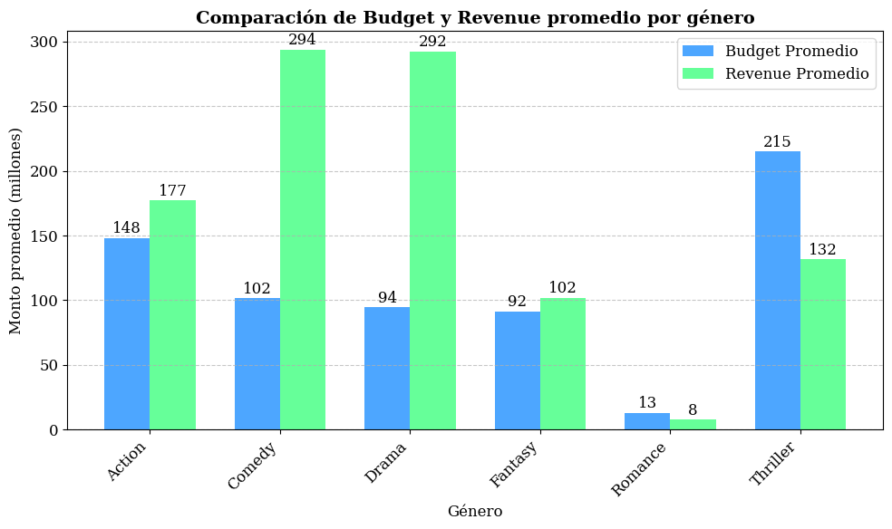

# Movie data analysis

Este proyecto consiste en el analisis de un dataset de películas, que incluyen: limpieza de datos y visualización de resultados.

## Contenido del repositorio
- `moviesdataset_clean.csv` → dataset limpio, listo para análisis.
- `MartinezL-movie_challenge-data.ipynb` → notebook con la limpieza, análisis y gráficos.
- `README.md`

## Limpieza de datos
- Se eliminaron filas con valores nulos en columnas clave (`Genre`, `Budget`, `Revenue`, `IMDB_Rating`).
- Se convirtieron valores inconsistentes:
  - `"80M"` → `80000000`
  - `"Two Thousand"` → `2000`
- Se eliminaron filas duplicadas.
- Se creó la columna `Profit` = `Revenue - Budget`. Esta columna se creo para mostrar las ganancias netas, es decir la diferencia entre lo que se invirtio y lo que se recaudo en cada pelicula.

## Insights principales
1. **Géneros más rentables:** Se observo que los generos mas rentables son en primer lugar drama y comedia, seguidos por gran diferencia por acción, fantasia y romance. El género que menos rentabilidad tiene es el de thriller, lo cual se puede deber a la inversión que se debe realizar para llevar a cabo cada pelicula (efectos especiales, maquillaje, escenografías, etc)
2. **Tendencia de rating por género:** Los géneros que mejor promedio de puntuación de rating obtuvieron son: Acción, comedia, drama y thriller. Los géneros romance y fantasia obtuvieron un promedio de rating por debajo de 5.
3. **Relacion ganancia neta-rating por género:** Se puede observar que hay una tendencia a que cuando el rating promedio de los géneros son buenos, las ganancias de los mismos también lo han sido. Por ende, podemos establecer a primera vista una relacion directa entre ambos.
4. **Relación presupuesto–ingreso:** Los géneros de comedia y drama, requieren una menor inversión para la recaudación obtenida en comparación con los géneros thriller y romance.Los géneros fantasia y acción generan ganancias pero la diferencia entre el presupuesto y la recaudación es mas pequeña.

## Visualizaciones
1. **Ganancia y rating promedio por género:**

   
2. **Evolución de ratings IMDB y ganancias por año:**

   
3. **Relación presupuesto vs recaudación por género:**

## Conclusión
